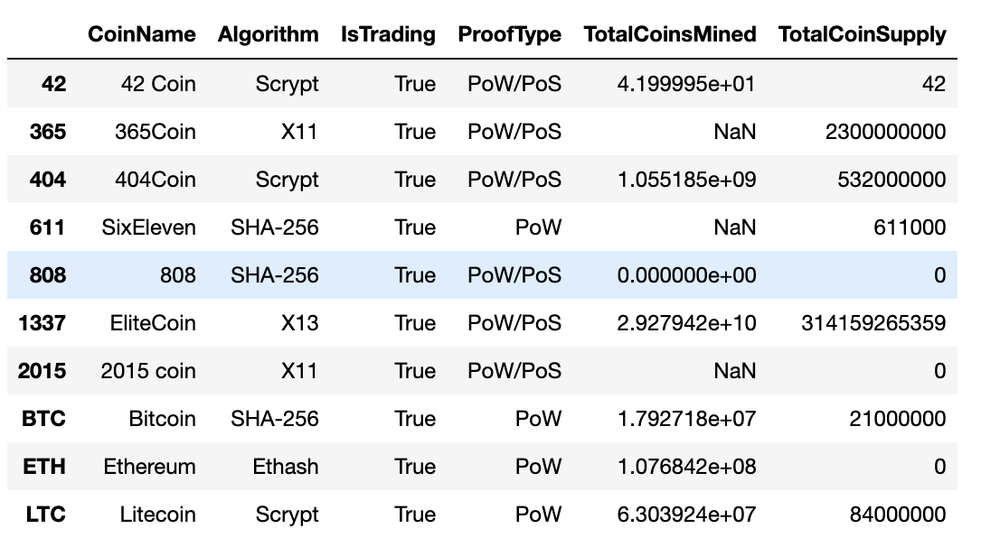
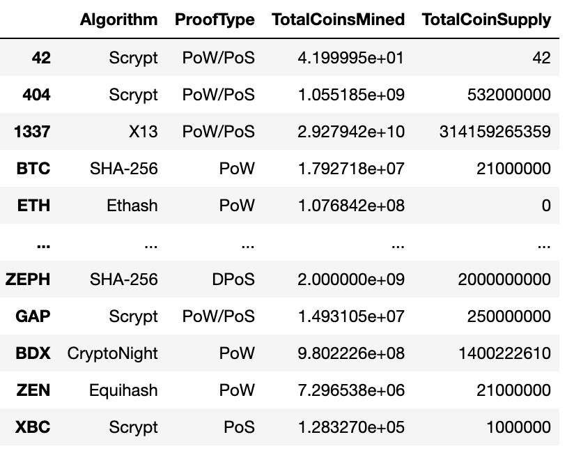
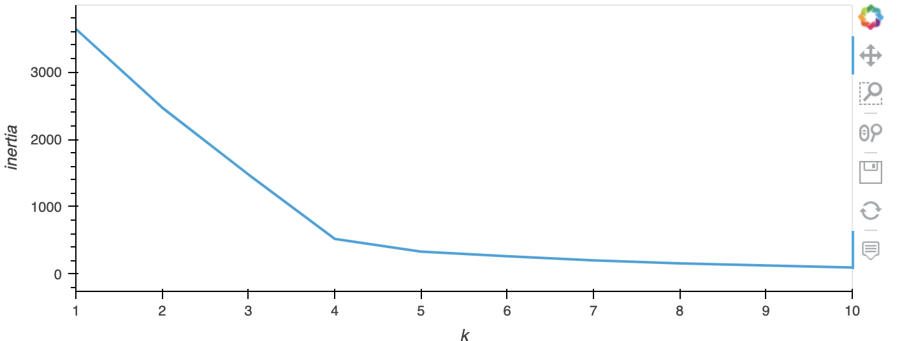
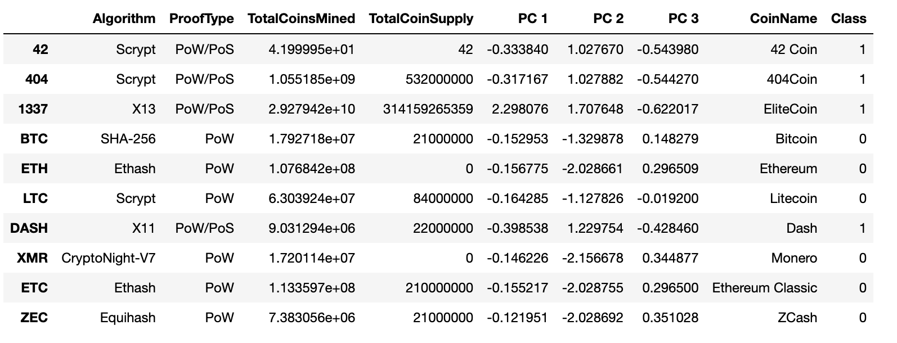
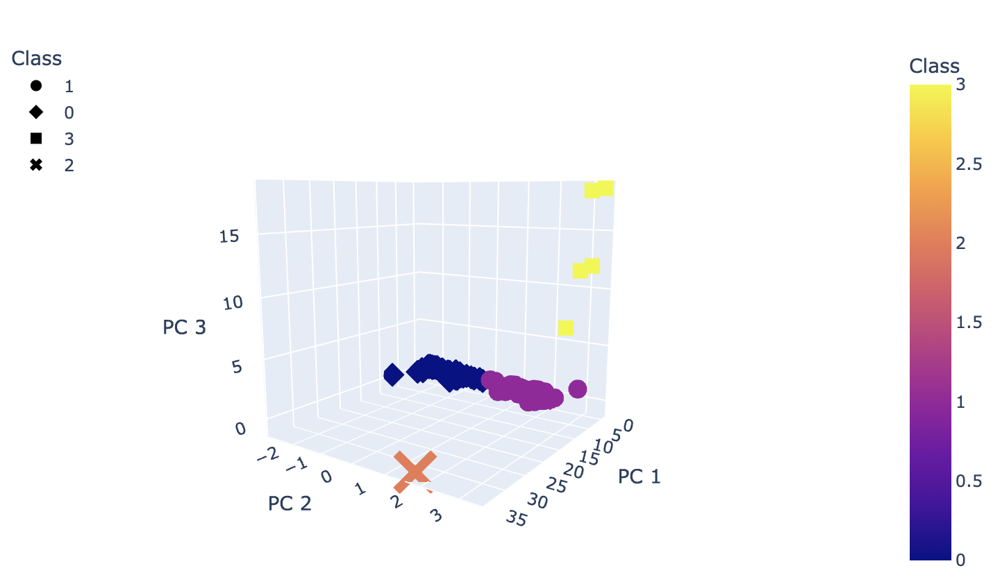
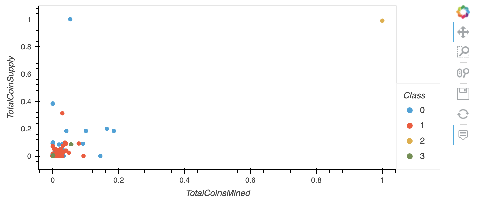

# Cryptocurrencies Analysis

## Overview
This analysis uses the unsupervised machine learning K-Means algorithm to categorize cryptocurrencies and visualizes these categories in tables and 2D and 3D graphs. The original dataset was taken from CryptoCompare. The original data is located [here](https://min-api.cryptocompare.com/data/all/coinlist). 

Beginning with a csv file, the first step is to preprocess the data.

### Original dataset sample:

From here, the data was filtered and altered so that it could be processed efficiently,

- Data was filtered to include only actively traded coins.
- Rows with null values were dropped.
- Coins that have not been mined were dropped.
- The "IsTrading" and "CoinName" columns were dropped as they were no longer relevant to categorization.
- The CoinName data was stored in another DataFrame

### Filtered and cleaned dataset sample:

At this point, the Pandas `get_dummies` function was used to create numerical fields from language (or object) data. The result was scaled using StandardScaler. Once scaled, the PCA module was used to reduce the data to three principal components. This data was used to create an Elbow Curved in order to determine the apropriate amount of clusters for the data set. 

### Elbow Curve:

After determining that four clusters should be created from this dataset, a K-Means model was created and put to use. The model was then fit with the principal component data and predictions were made, generating the four clusters. So that the clusters and other data can be visualized together, a new DataFrame was created that incorporates,
- the releveant clustering information,
- the principal component data,
- the CoinName data (stored seperately earlier),
- and the cluster number stored in the "Class" column.

### DataFrame with cluster data sample:

From this point, it was easy to create visuals. A graph was made to show how coins appear in a 3D space with their grouping, which was determined by the K-Means unsupervised machine learning model, represented by their shape and color. Another 2D plot was created to display the relationship between total coins mined and total coin supply for each cryptocurrency, with the K-Means determined class represented by the color of each point on the graph.

### 3D Categories:

### Coins mined and coin supply by class:

